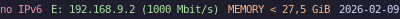

<h3 align="center">
	<br/>
	
	Catppuccin for <a href="https://i3wm.org/i3status/">i3status</a>
	
</h3>

<p align="center">
	<a href="https://github.com/catppuccin/i3status/stargazers"></a>
	<a href="https://github.com/catppuccin/i3status/issues"></a>
	<a href="https://github.com/catppuccin/i3status/contributors"></a>
</p>

<p align="center">
	
</p>

## Previews

<details>
<summary>🌻 Latte</summary>

</details>
<details>
<summary>🪴 Frappé</summary>

</details>
<details>
<summary>🌺 Macchiato</summary>

</details>
<details>
<summary>🌿 Mocha</summary>

</details>

## Usage

1. Locate your i3status configuration file, should be from one of the following path as said in the [manpage](https://i3wm.org/i3status/manpage.html):
	- ~/.config/i3status/config (or $XDG_CONFIG_HOME/i3status/config if set)
	- /etc/xdg/i3status/config (or $XDG_CONFIG_DIRS/i3status/config if set)
	- ~/.i3status.conf
	- /etc/i3status.conf

2. Copy the contents of your flavor of choice from [`themes/`](./themes/) to your i3status configuration file. Your `general` bloc should ressemble the following (here for mocha):
```c
general {
        colors = true
        color_good = "#a6e3a1"
        color_degraded = "#fab387"
        color_bad = "#f38ba8"
        interval = 5
}
```

&nbsp;

<p align="center">
	
</p>

<p align="center">
	Copyright &copy; 2021-present <a href="https://github.com/catppuccin" target="_blank">Catppuccin Org</a>
</p>

<p align="center">
	<a href="https://github.com/catppuccin/catppuccin/blob/main/LICENSE"></a>
</p>
